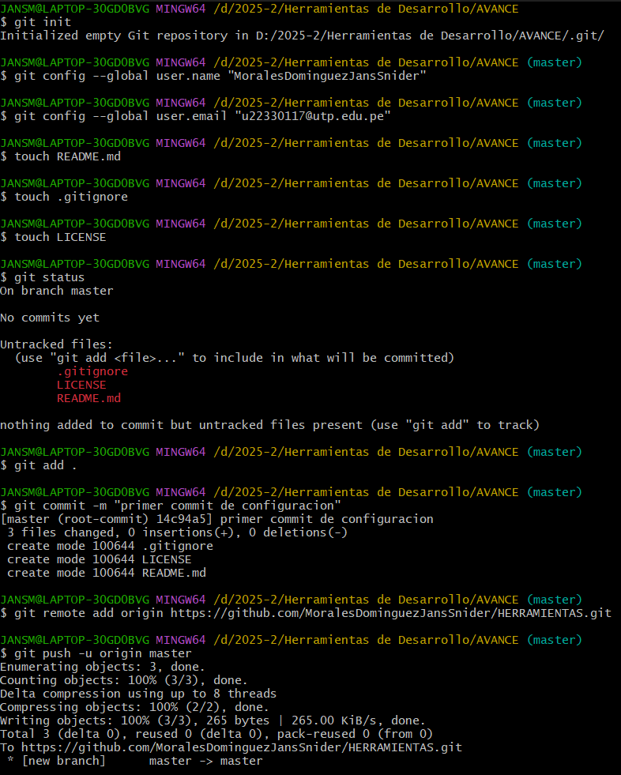

# 🚀 Flujo de trabajo en Git

Este documento explica los pasos básicos para trabajar con **Git** y **GitHub** de forma ordenada.

---
## 🔹 1. instalacion para el proyecto

> [!NOTE] 
> ## :inbox_tray: Instalación
>Para ejecutar el proyecto localmente, sigue los siguientes pasos:
>1. Clona este repositorio:
>     ~~~bash
>     git clone https://github.com/Renzito0637d/Proyect_Integrator_1.git
>     ~~~
>2. Abre el proyecto en tu entorno de desarrollo.
> 
>      
> 
> 
>   3. Compila y ejecuta los proyectos.
>   
>       **Backend**:
>       ~~~bash
>       cd Proyect_Integrator_1\ucvBackend
>       mvn clean install
>       mvn spring-boot:run         
>       ~~~
>
>       **Frontend**:
>       ~~~bash
>       cd Proyect_Integrator_1\ucvfrontend
>       npm install
>       npm start         
>       ~~~
>
>       **Base de datos**:
>
>       Ejecutar el [script](https://github.com/Renzito0637d/Proyect_Integrator_1/blob/main/script_db.sql "Script de la base de datos")  en MySQL Workbench, **en caso de no haber conexión  con la base de datos configurar [app properties](https://github.com/Renzito0637d/Proyect_Integrator_1/blob/main/ucvBackend/src/main/resources/application.properties "En este archivo del proyecto podrás configurar la conexión de la base de datos MySQL") debes de configurar la _url_, _username_ y _password_ de la DB**.
>       ~~~bash
>       create DATABASE ucvincidencia;
>       use ucvincidencia;         
>       ~~~


## 🔹 2. Inicialización del repositorio
```bash
git init
git config --global user.name "MoralesDominguezJansSnider"
git config --global user.email "u22330117@utp.edu.pe"
touch README.md
touch .gitignore
touch LICENSE
git status
git add .
git commit -m "primer commit de configuracion"
git remote add origin https://github.com/MathiasUX/HERRAMIENTAS-DE-DESARROLLO.git
git push -u origin master
```
## 🔹 3. IMAGEN DE REPOSITORIO

